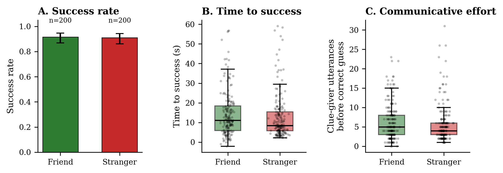
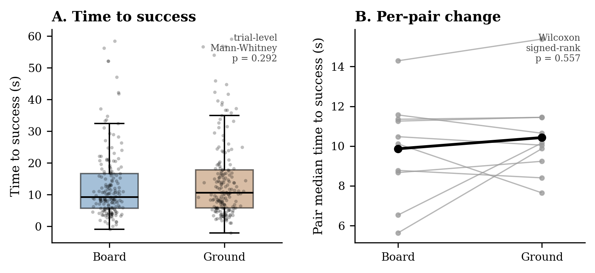

# Pre-registration (on [AsPredicted.org](https://aspredicted.org/index.php))
The following document consists of prompts for a preregistration based on the format adopted by [*AsPredicted*](https://aspredicted.org/index.php)

## Authors (in alphabetical order)
-  Solveigh Janzen ([`solveigh.janzen@uni-koeln.de`](mailto:solveigh.janzen@uni-koeln.de))
-  Kristina Koch ([`kkoch@tcd.ie`](mailto:kkoch@tcd.ie))
-  Matteo Schmelzer ([`matteo.schmelzer@uni-koeln.de`](mailto:matteo.schmelzer@uni-koeln.de))
-  Tim Murphy ([`tim.murphy@bristol.ac.uk`](mailto:tim.murphy@bristol.ac.uk))
-  Nthabiseng Shongwe ([`nthabiseng.shongwe@ru.nl`](mailto:nthabiseng.shongwe@ru.nl))

## Question 1 - Data collection
**Transcript & Demographic data.** We developed two Python scripts (`fetch_metadata_demographics.py` and `fetch_textgrid_transcripts.py` to scrape the transcript data from the [Balance Corpus Explorer](https://thebalancecorpus.warwick.ac.uk/explore#). This provided us with the OpenAI Whisper transcripts that had been proof-checked by the authors. We decided to go with this approach instead of running Whisper locally because it saved time and provided us with higher quality transcripts for 10 dyads (only three dyads were provided in the MDIG2026 repository). This increase in data will give us more statistical power to test the hypotheses below. Note: the 10 dyads featured on the Balance Corpus Explorer explicitly gave consent for their data to be shared publicly.

**Video & Audio data.** Video and audio data from three dyads were made available to us through the MDIG2026 Summer School GitHub repository. 

## Question 2 - Hypotheses
**1. The use of gesture increases (in terms of number of gestures as well as, complexity and gesture space used) when participants are unfamiliar with one another, in comparison to when they are familiar with one another.**

-   [**add_lit_here**]

We only had three dyads available to us, which limits what we can do and the statistical power we can achieve. Nonetheless, for each trial (N=40 per dyad, 120 in total) we used OpenPose to calculate gesture rate and gesture duration. Ideally, we would have more data and we would run something like a linear mixed effects model (LME). This would control for the fact that individual trials are not independent data points - all trials within a dyad are related to each other as they are interactions between the same two people - by using a random intercept. See future directions for more information.

**2. Participants that are familiar with one another have a higher success rate (more times successful).**

-   [**add_lit_here**]

This is an exploratory result as we use the 10 dyads from the balance corpus explorer (N=400 trials) rather than the 4 dyads used in the confirmatory Hypothesis 1. For initial findings see Fig. [-@fig-relationshipFindings, a)]. We find there is no support for this hypothesis. Success rate was near-identical for both groups (friend 91.5%; stranger 91.0%; trial-level $\chi$²=0.00, p=1.00; pair-level Mann Whitney U=11.0, p=.831; logistic regression controlling for condition: OR=0.94 for stranger vs friend, p=.859). An overall ~91% success rate leaves little room for a relationship effect to surface, suggesting a likely ceiling effect, rather than a clean rejection of this hypothesis.

**3. Dyads with participants that are familiar with one other will take longer to accomplish a trial (consisting of a round of taboo) in comparison to dyads that are unfamiliar with one another. We assume this because familiarity enables the use of shared humour and in-jokes, which may increase enjoyment but simultaneously slow down effective guessing.**

-   [**add_lit_here**]

This is also exploratory as we use the 10 dyads from Hypothesis 2 (N=400 trials). We find weak support for this hypothesis at the trial level, but not at the pair level. For initial findings see Fig. [-@fig-relationshipFindings, b)]. Friend dyads took longer to reach a correct guess (median 11.13s vs 8.46s for strangers; trial-level Mann Whitney U p=.056) and needed slightly more clue-giver utterances before success (mean 6.24 vs 5.79, p=.194). Both results are in the predicted direction but neither holds up at the pair level, whee we collapse to one value per pair (Mann Whitney U=20.0, p=.151). With only 10 pairs in total, this is underpowered either way.

{#fig-relationshipFindings}

**4. Participants on the balance board take longer to successfully complete the Taboo task, due to increased allotment of resources allocated to balancing.**

-   [**add_lit_here**] this is based on studies that show that walking and unipedal standing caused participants to solve tasks more quickly, but we assume that balancing is more cognitively demanding as shown in another study

This is (yet again) exploratory as we use the 10 dyads from Hypotheses 2 and 3 (N=400 trials). We find no support for this hypothesis, see Fig. [-@fig-timeToSuccessFindings] If anything, we find that the non-significant trend is in the opposite direction. Trials on the balanace board were faster, not slower, than trials on stable ground (median 9.31s vs 10.62s; trial-level Mann Whitney U p=.292; paired per-pair Wilcoxon W=21.0, p=.557). Taboo word rule slips (accidentally saying a forbidden word) were also statistically indistinguishable between conditions (15.5% vs 14.0% of trials, $\chi$²=.08, p=.778).

{#fig-timeToSuccessFindings}

## Question 3 - Dependent variable(s)
Our dependent variable is success rate, which is operationalised as described under *5. Analyses*.

## Question 4 - Conditions
1. **familiarity** -- Here we are comparing two different dyad compositions, consisting of either two friends or two strangers (with the caveat that with currently available data, this is based on a binary measure based on participant responses to a questionnaire -- for a comprehensive study, this measure should to be refined to more accurate measure duration and closeness of the relationships between participants).

2. **balance board** -- Here we are comparing clue-givers standing on a one-axis balance board (unstable) to the same clue-givers while standing on the floor (stable).

## Question 5 - Analyses
Our analysis is based on an existing dataset used for an original study by Li et al. [-@li2026]. We plan to extract and analyse gestures using `EnvisionBoxHGDetector` [@pouw2025a] using the video files provided in the original study. Based on this output we are measuring:
-   gestural rate (per trial)
-   gesture space (per trial)
-   gesture duration (per trial)

In addition, we are measuring success rate of individual trials based on existing proofread transcripts of used in the original study. A trial only counts as a success if the guesser (not the clue giver) says the target word before the 60 second game clock expires. This is adjudicated rather than a simple text search so that we can handle several patterns found in the corpus, e.g.:
- whole-word matching that tolerates regular plural/spelling variants (e.g., "donut"/"doughnut") and words split across two annotator segments (e.g., "zip" + "per" for "zipper")
- exclusion of trials where only the clue giver accidentally said the target word (a rule slip, not a guess)
- exclusion of correct guesses that occurred after the timer had run out
- the 60s clock is timed from the clue-giver's first spoken segment, not from t=0 of the recording

For successful trials, we additionally measure:
- **time to success**: seconds from the clue-giver's first utterance to the guesser's correct guess
- **communicative effort**: the number of clue-giver utterances produced before the correct guess

Additionally, it would be interesting to base this measure on the number of attempts at guessing (which is different from the number of tokens produced until taboo word is guessed (fillers))

## Questions 6 - Outliers and exclusions
We are excluding bilingual speakers as well as non-L1 speakers of English, to limit variablity of cultural context which has an effect on mutual reference available between dyad partners.

## Question 7 - Sample size
-   4 dyads à 40 trials (*N*=160)
-   5 female, 3 male participants, 7 native monolingual speakers of English, one bilingual, L2 speaker (L1 Mandarin)

## Question 8 - Other
Reasoning for question 1) answer:
We are working with an already collected data set, which was analysed under different research questions, and made publically available by the authors of the original study (@li2026).

## Question 9 - Name
`wobblyFriends` - (MDIG2026 envisionbox Summer school)

## Question 10 - Type of study
`a)`

## Question 11 - Data source
`other`: Original audio and video files were taken from Li et al.'s [-@li2026] [zenodo](https://doi.org/10.5281/zenodo.19853626) repository

## Limitations / future directions
The following are not part of the preregistration as formatted on [*AsPredicted.org*](https://aspredicted.org/index.php).

### enhanced demographics
For a follow up replication of the basic setup, we would aim to collect more detailled demographics, to more reliably analyse differences in the success rate and language and gesture use of participants.

Participant acquaintance (aka "friendship") should ideally be recorded in more depth than a binary measure recorded in the original study. A more accurate measure of friendship could at least consist of a questionnaire collecting information about level and duration of acquaintance. Sociocultural background needs to be considered as well, as different cultures' variety in using terms (such as "friend", "acquaintance") to describe friendship, although this might be already covered through the questionnaire items described above.

Further balancing ability of participants should be more accurately captured on the day of the experiment. This could be implemented by administering a simple hearing test, as well as recording a baseline of participants' balancing ability on the balance board.

Participant acuity (relevant to playing Taboo) on the day of should also be tested, as it is likely to be influened by participant alertness, exhaustion.

### cognitive load induced via balance board
Induce more cognitive load onto participants by employing either a unidirectional balance board, which is more demanding to balance on. Alternatively (and this changes the manipulation/stimulus of the cognitive load), a platform that can simulate the regular sway of a ship or a random movement of the ground during an earthquake.

The taboo task itself could also be modified to be a challenge in which the goals is to complete as many rounds of taboo within a set timeframe. This would (in motivated participants) increase pressure and add to the load induced through the balance board.

### data annotation
Audio recordings should be manually labelled in more detail to indicate individual guessing attempts to compare duration until success and tokens produced

### data availability
If we were to make additional recordings (or record a new set of recordings using the, possibly modified, setup) we would strongly consider applying a masking algorithm such as `MaskAnyone` [@owoyele2024] or `masked piper` [@owoyele2022a] to de-identify data and thus increase our ability to make data publically available for other researchers to use in their experiments.



# References
